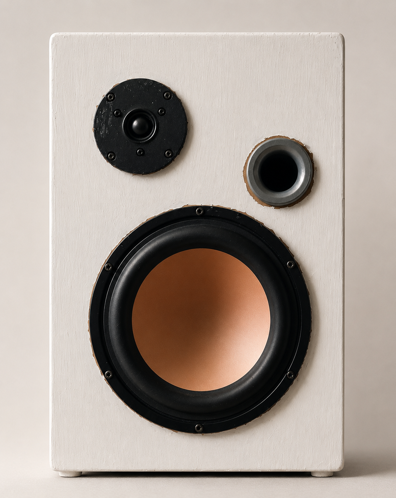

<h1 align="center">
	 
		
	 
		AcoustiTeK
	 
</h1>

<h4 align="center">
	AcoustiTeK is an open-source passive Hi-Fi loudspeaker designed for home studios and critical listening.
	Built around carefully selected drivers, a custom-designed passive crossover, and a bass reflex enclosure,
	it aims to deliver accurate sound reproduction while remaining affordable and fully DIY.
</h4>

---

	<a href="#key-features">Key Features</a> •
	<a href="#project-components">Project Components</a> •
	<a href="#how-to-build">How To Build</a> •
	<a href="#credits">Credits</a> •
	<a href="#license">License</a>

---

## Key Features

- **Passive Two-Way Design:** Traditional analog loudspeaker with no DSP or integrated amplifier.
- **Bass Reflex Cabinet:** Optimized 22 L enclosure tuned to **34 Hz** for extended low-frequency response.
- **Custom Passive Crossover:** Second-order (12 dB/octave) Butterworth crossover designed and optimized in VituixCAD.
- **Affordable Hi-Fi:** Designed to achieve high-quality sound reproduction while keeping the driver budget below €200 per pair.
- **Open Hardware:** Complete documentation, simulations, assembly guide, and Bill of Materials available for anyone wishing to build their own pair.

---

# Technical Documentation

The complete design process, simulations, acoustic analysis, crossover calculations, measurements, and construction guide can be found inside the <a href="https://github.com/PoliTeK/AcoustiTeK/tree/main/documents">**documents**</a> folder included in this repository.

---

# Project Components

The components listed below are available from major distributors such as SoundImports, Mouser Electronics and DigiKey.

## Drivers

| Component | Model |
|-----------|-------|
| Woofer | HiVi M8N-1 |
| Tweeter | SB Acoustics SB21SDC-C000-4 |

## Crossover Components

| Component | Value |
|----------|------|
| Woofer Inductor | 2.2 mH |
| Woofer Capacitor | 33 µF |
| Woofer Capacitor | 5 µF |
| Tweeter Capacitor | 15 µF |
| Tweeter Capacitor | 3.9 µF |
| Tweeter Inductor | 470 µH |
| Series Resistor | 470 mΩ |

## Cabinet

| Component | Specification |
|-----------|---------------|
| Material | MDF |
| Thickness | 10 mm (14–16 mm also supported) |
| Internal Volume | 22 L |
| Reflex Port Diameter | 38 mm |
| Reflex Port Length | 10.5 cm |
| Acoustic Damping | Rock Wool |

## Connectors

| Component | Description |
|-----------|-------------|
| Input Terminals | Standard Binding Posts |
| Internal Wiring | 1.5 mm² Copper Wire |

---

# How To Build

### Cabinet Assembly

1. Cut all MDF panels according to the provided drawings.
2. Drill the front panel for the woofer, tweeter and bass reflex port.
3. Assemble the cabinet using wood glue and screws.
4. Install the internal acoustic damping material.
5. Mount the crossover inside the enclosure.
6. Install the drivers and connect them with the correct polarity.
7. Verify the cabinet is completely airtight before closing.

### Crossover Assembly

The passive crossover is built on a universal through-hole PCB.

- Assemble the components following the provided schematic.
- Verify all electrical connections before installing the crossover.
- Test the drivers at low volume before sealing the cabinet.

### Simulations

The project uses two free software packages:

- **WINISD** for bass reflex cabinet simulations.
- **VituixCAD** for crossover optimization and complete loudspeaker response simulation.

Simulation files are available inside the repository.

---

## Project Specifications

| Specification | Value |
|--------------|-------|
| Configuration | Passive 2-Way |
| Woofer Size | 8" |
| Cabinet Type | Bass Reflex |
| Internal Volume | 22 L |
| Reflex Tuning | 34 Hz |
| F3 | ≈40 Hz |
| Nominal Impedance | 8 Ω |
| Estimated Pair Cost | €250–300 |

---

## Credits

AcoustiTeK was developed as a Politecnico di Torino project.

Project Team:

- Filippo Vignoli — Project Manager
- Federico Ughetti — Cabinet Design & Manufacturing
- Filippo Giacomin — Vice Project Manager & Welding

---

## License

MIT

---

	<a href="mailto:info.politek23@gmail.com">E-Mail</a> •
	<a href="https://www.instagram.com/politek_music">Instagram</a> •
	<a href="https://t.me/+dLKMAwzNmQYxNzM0">Telegram Community</a>

